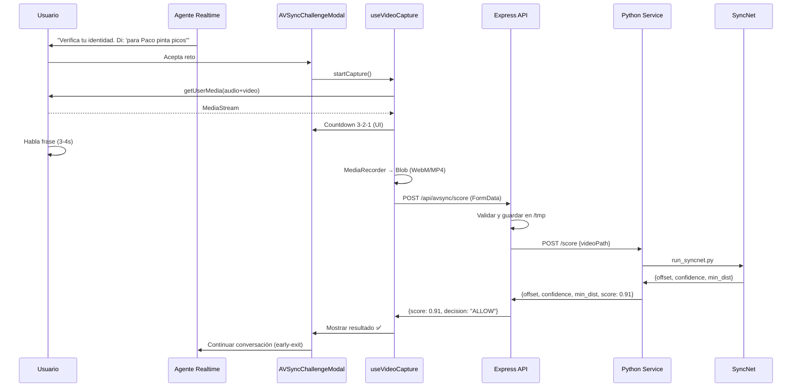

# Plan de Implementación: Validador de Deepfake con SyncNet

**Fecha:** 2025-11-01
**Proyecto:** Dani Voice Assistant - AV-Sync Deepfake Detection
**Versión:** 1.0
**Estado:** Draft para Aprobación

---

## 📋 Tabla de Contenidos

1. [Resumen Ejecutivo](#resumen-ejecutivo)
2. [Análisis del Estado Actual](#análisis-del-estado-actual)
3. [Arquitectura Propuesta](#arquitectura-propuesta)
4. [Componentes a Desarrollar](#componentes-a-desarrollar)
5. [Setup de Infraestructura Local](#setup-de-infraestructura-local)
6. [Integración con Flujo Actual](#integración-con-flujo-actual)
7. [Fases de Implementación](#fases-de-implementación)
8. [Testing y Validación](#testing-y-validación)
9. [Consideraciones Técnicas](#consideraciones-técnicas)
10. [Roadmap y Timeline](#roadmap-y-timeline)
11. [Riesgos y Mitigaciones](#riesgos-y-mitigaciones)

---

## 1. Resumen Ejecutivo

### Objetivo

Transformar el asistente de voz "Dani" en un **validador de deepfake en tiempo real** mediante la integración de **SyncNet** para detectar sincronía audio-visual (labios↔voz), ejecutándose completamente en modo local sin infraestructura externa.

### Alcance MVP (Sprint 1-2)

- ✅ Captura de video+audio durante interacción con el agente (3-4 segundos)
- ✅ Análisis de sincronía audio-labial con SyncNet (Python local)
- ✅ Sistema de decisión con early-exit (ALLOW/NEXT/BLOCK)
- ✅ UI/UX integrada con feedback visual del proceso
- ✅ Ejecución 100% local (sin dependencias cloud)

### Métricas de Éxito

| Métrica | Objetivo |
|---------|----------|
| **T<sub>reto</sub>** | ≤ 15 segundos (instrucción + captura + análisis) |
| **T<sub>E2E</sub>** | ≤ 25 segundos (incluyendo render de decisión) |
| **Early-exit rate** | ≥ 60% en usuarios legítimos |
| **False positive rate** | < 3-5% |
| **Latencia de análisis** | < 8 segundos (p95) |

---

## 2. Análisis del Estado Actual

### 2.1 Stack Tecnológico Actual

**Frontend:**
```typescript
- React 18.3.1 + TypeScript 5.8.3
- Vite 5.4.19 (build tool)
- OpenAI Realtime API (WebRTC)
- Three.js 0.165.0 (visualización 3D)
- Shadcn/ui + Radix UI (componentes)
```

**Backend:**
```typescript
- Express 4.18.2 (servidor dev local)
- Vercel Serverless Functions (producción)
- Node.js API routes
```

**Arquitectura de Hooks Actual:**
```
useLirvana (orchestrator)
├── useWebRTC (gestión WebRTC + OpenAI)
├── useAudio (procesamiento audio navegador)
└── useSpeechRecognition (fallback Web Speech API)
```

### 2.2 Capacidades Existentes que Aprovechamos

✅ **Ya implementado:**
- Captura de audio en tiempo real (WebRTC + MediaRecorder API)
- Gestión de permisos de micrófono
- Sistema de herramientas (tools) extensible en `lirvanaTools.ts`
- Hook orchestrator (`useLirvana`) con arquitectura modular
- UI/UX con orbe 3D reactivo a audio
- Sistema de logging centralizado

⚠️ **Falta implementar:**
- Captura de video desde getUserMedia
- Servicio Python local para SyncNet
- API endpoint para análisis de sincronía
- Hook `useVideoCapture` para grabación A/V
- Componente modal de captura con countdown
- Lógica de decisión con early-exit

---

## 3. Arquitectura Propuesta

### 3.1 Diagrama de Arquitectura (Local-First)

```
┌─────────────────────────────────────────────────────────────┐
│                   BROWSER (React App)                        │
│                                                              │
│  ┌────────────────────────────────────────────────────┐    │
│  │  UI Layer                                          │    │
│  │  ├── AVSyncChallengeModal (nuevo)                 │    │
│  │  │   ├── VideoPreview                             │    │
│  │  │   ├── Countdown (3-2-1)                        │    │
│  │  │   └── ResultDisplay (✅⚠️❌)                    │    │
│  │  └── ChatBox (existente - agregar trigger)        │    │
│  └──────────────────┬─────────────────────────────────┘    │
│                     │                                       │
│  ┌──────────────────▼─────────────────────────────────┐    │
│  │  Hook Layer                                        │    │
│  │  ├── useLirvana (orchestrator) ← EXTENDER         │    │
│  │  ├── useWebRTC (existente)                        │    │
│  │  ├── useAudio (existente)                         │    │
│  │  └── useVideoCapture (NUEVO)                      │    │
│  │      ├── getUserMedia(audio+video)                │    │
│  │      ├── MediaRecorder → Blob                     │    │
│  │      └── uploadToLocal()                          │    │
│  └──────────────────┬─────────────────────────────────┘    │
│                     │                                       │
│  ┌──────────────────▼─────────────────────────────────┐    │
│  │  Service Layer                                     │    │
│  │  ├── lirvanaTools.ts ← AGREGAR av_sync_tool       │    │
│  │  └── avSyncService.ts (NUEVO)                     │    │
│  │      └── POST /api/avsync/score                   │    │
│  └──────────────────┬─────────────────────────────────┘    │
└────────────────────┼─────────────────────────────────────┘
                     │ HTTP POST (FormData)
                     │ video: Blob (WebM/MP4)
                     │ sessionId: string
                     │
┌────────────────────▼─────────────────────────────────────┐
│         LOCALHOST:3001 (Express Server)                  │
│                                                          │
│  ┌────────────────────────────────────────────────┐    │
│  │  API Route: /api/avsync/score                  │    │
│  │  ├── Validar request (MIME, duración)         │    │
│  │  ├── Guardar clip → /tmp/uploads/             │    │
│  │  └── Forward → Python Service                  │    │
│  └──────────────────┬─────────────────────────────┘    │
└────────────────────┼─────────────────────────────────────┘
                     │ HTTP POST
                     │ {videoPath: string}
                     │
┌────────────────────▼─────────────────────────────────────┐
│     LOCALHOST:5000 (Python Flask/FastAPI)                │
│                                                          │
│  ┌────────────────────────────────────────────────┐    │
│  │  Endpoint: POST /score                         │    │
│  │  ├── Extraer frames/audio con ffmpeg          │    │
│  │  ├── Detectar cara (S3FD)                     │    │
│  │  ├── SyncNet forward pass                     │    │
│  │  └── Calcular métricas                        │    │
│  │      {offset, confidence, min_dist, score}    │    │
│  └────────────────────────────────────────────────┘    │
│                                                          │
│  ┌────────────────────────────────────────────────┐    │
│  │  SyncNet Pipeline (joonson/syncnet_python)    │    │
│  │  ├── Models: syncnet_v2.model, sfd_face.pth   │    │
│  │  ├── Scripts: run_syncnet.py wrapper          │    │
│  │  └── Dependencies: PyTorch, ffmpeg, opencv    │    │
│  └────────────────────────────────────────────────┘    │
└──────────────────────────────────────────────────────────┘
```

### 3.2 Flujo de Datos



### 3.3 Componentes del Sistema

| Layer | Componente | Tipo | Estado |
|-------|-----------|------|--------|
| **UI** | `AVSyncChallengeModal.tsx` | Component | 🆕 Nuevo |
| **UI** | `VideoPreview.tsx` | Component | 🆕 Nuevo |
| **UI** | `ResultFeedback.tsx` | Component | 🆕 Nuevo |
| **Hook** | `useVideoCapture.ts` | Custom Hook | 🆕 Nuevo |
| **Hook** | `useLirvana.ts` | Orchestrator | 🔧 Extender |
| **Service** | `avSyncService.ts` | TS Service | 🆕 Nuevo |
| **Service** | `lirvanaTools.ts` | TS Service | 🔧 Extender |
| **API** | `/api/avsync/score` | Express Route | 🆕 Nuevo |
| **Backend** | `syncnet-service` | Python Flask | 🆕 Nuevo |
| **Backend** | `syncnet_wrapper.py` | Python Script | 🆕 Nuevo |

---

## 4. Componentes a Desarrollar

### 4.1 Frontend - Nuevos Componentes

#### **AVSyncChallengeModal.tsx**

Modal principal del reto de sincronía.

**Props:**
```typescript
interface AVSyncChallengeModalProps {
  isOpen: boolean;
  onClose: () => void;
  onComplete: (result: AVSyncResult) => void;
  challengePhrase?: string;
  agentVoice: (text: string) => void;
}

interface AVSyncResult {
  score: number;           // 0-1
  offset_frames: number;
  confidence: number;
  min_dist: number;
  lag_ms: number;
  decision: 'ALLOW' | 'NEXT' | 'BLOCK';
  timestamp: string;
}
```

**Estados:**
```typescript
type ChallengeState =
  | 'instructions'    // Mostrar instrucciones
  | 'countdown'       // 3-2-1
  | 'recording'       // Grabando (3-4s)
  | 'processing'      // Spinner + "Analizando..."
  | 'result';         // Mostrar resultado
```

**Funcionalidades:**
- ✅ Mostrar frase a repetir
- ✅ Countdown visual animado (3-2-1)
- ✅ Preview de cámara en tiempo real
- ✅ Indicador de grabación activa
- ✅ Spinner durante análisis
- ✅ Resultado con iconos (✅⚠️❌) + métricas
- ✅ Botones: Reintentar / Continuar

#### **VideoPreview.tsx**

Componente de preview de cámara.

```typescript
interface VideoPreviewProps {
  stream: MediaStream | null;
  isRecording: boolean;
  countdown: number | null;
  onPermissionDenied: () => void;
}
```

**Características:**
- Video element con `srcObject = stream`
- Overlay circular para detectar rostro
- Badge de estado (🔴 GRABANDO / ⏸️ PAUSA)
- Manejo de errores de permisos

#### **ResultFeedback.tsx**

Display de resultados del análisis.

```typescript
interface ResultFeedbackProps {
  result: AVSyncResult;
  onRetry: () => void;
  onContinue: () => void;
}
```

**UI por decisión:**

| Decision | Icon | Color | Message | Actions |
|----------|------|-------|---------|---------|
| `ALLOW` | ✅ | Verde | "Verificación exitosa" | [Continuar] |
| `NEXT` | ⚠️ | Ámbar | "Verificación inconclusa. Reto adicional" | [Siguiente Reto] |
| `BLOCK` | ❌ | Rojo | "Alto riesgo detectado" | [Reintentar] [WebAuthn] |

**Métricas mostradas:**
```
Score: 91/100 ✅
Sincronía: +3 frames (100ms)
Confianza: 10.02
```

### 4.2 Frontend - Nuevo Hook

#### **useVideoCapture.ts**

Hook para captura de video+audio.

```typescript
interface UseVideoCaptureConfig {
  duration?: number;          // Default: 4000ms
  mimeType?: string;          // Default: 'video/webm;codecs=vp9,opus'
  videoBitsPerSecond?: number; // Default: 2500000
  constraints?: MediaStreamConstraints;
}

interface UseVideoCaptureReturn {
  // State
  stream: MediaStream | null;
  isCapturing: boolean;
  isPaused: boolean;
  countdown: number | null;
  recordedBlob: Blob | null;
  error: string | null;

  // Methods
  requestPermissions: () => Promise<void>;
  startCapture: () => Promise<void>;
  stopCapture: () => void;
  pauseCapture: () => void;
  resumeCapture: () => void;
  resetCapture: () => void;

  // Utils
  downloadBlob: () => void;
  getVideoUrl: () => string | null;
}
```

**Implementación clave:**

```typescript
const startCapture = async () => {
  try {
    // 1. getUserMedia
    const mediaStream = await navigator.mediaDevices.getUserMedia({
      audio: {
        echoCancellation: true,
        noiseSuppression: true,
        sampleRate: 24000,
      },
      video: {
        width: { ideal: 640 },
        height: { ideal: 480 },
        frameRate: { ideal: 30 },
        facingMode: 'user',
      },
    });

    setStream(mediaStream);

    // 2. Countdown
    for (let i = 3; i > 0; i--) {
      setCountdown(i);
      await sleep(1000);
    }
    setCountdown(null);

    // 3. MediaRecorder
    const recorder = new MediaRecorder(mediaStream, {
      mimeType: config.mimeType,
      videoBitsPerSecond: config.videoBitsPerSecond,
    });

    const chunks: Blob[] = [];
    recorder.ondataavailable = (e) => chunks.push(e.data);
    recorder.onstop = () => {
      const blob = new Blob(chunks, { type: config.mimeType });
      setRecordedBlob(blob);
      onComplete?.(blob);
    };

    recorder.start();
    setIsCapturing(true);

    // 4. Auto-stop después de `duration`
    setTimeout(() => {
      recorder.stop();
      mediaStream.getTracks().forEach(track => track.stop());
      setIsCapturing(false);
    }, config.duration);

  } catch (err) {
    setError(err.message);
    throw err;
  }
};
```

### 4.3 Frontend - Servicio

#### **avSyncService.ts**

Servicio para comunicación con API de análisis.

```typescript
export interface AVSyncScoreRequest {
  videoBlob: Blob;
  sessionId: string;
  userConsent: boolean;
  metadata?: {
    challengePhrase?: string;
    timestamp: string;
    userAgent: string;
  };
}

export interface AVSyncScoreResponse {
  offset_frames: number;
  confidence: number;
  min_dist: number;
  score: number;           // 0-1 normalizado
  lag_ms: number;
  decision: 'ALLOW' | 'NEXT' | 'BLOCK';
  ttl_ms: number;
  reason_codes?: string[];
  debug?: {
    pywork_path: string;
    pycrop_path: string;
  };
}

export class AVSyncService {
  private baseURL: string;

  constructor() {
    this.baseURL = import.meta.env.MODE === 'production'
      ? window.location.origin
      : import.meta.env.VITE_API_BASE_URL || 'http://localhost:3001';
  }

  async scoreVideo(request: AVSyncScoreRequest): Promise<AVSyncScoreResponse> {
    const formData = new FormData();
    formData.append('video', request.videoBlob, 'capture.webm');
    formData.append('session_id', request.sessionId);
    formData.append('user_consent', request.userConsent.toString());
    if (request.metadata) {
      formData.append('metadata', JSON.stringify(request.metadata));
    }

    try {
      const response = await fetch(`${this.baseURL}/api/avsync/score`, {
        method: 'POST',
        body: formData,
        // No headers - browser sets Content-Type con boundary
      });

      if (!response.ok) {
        const errorData = await response.json().catch(() => ({}));
        throw new Error(errorData.error || `HTTP ${response.status}`);
      }

      return await response.json();
    } catch (error) {
      console.error('[AVSyncService] scoreVideo error:', error);
      throw error;
    }
  }

  /**
   * Normalizar métricas de SyncNet a score 0-1
   * Formula: sigmoid(a * confidence - b * min_dist - c * |offset|)
   */
  private normalizeScore(
    confidence: number,
    min_dist: number,
    offset_frames: number
  ): number {
    // Pesos calibrados (ajustar con dataset)
    const a = 0.15;
    const b = 0.25;
    const c = 0.1;

    const z = a * confidence - b * min_dist - c * Math.abs(offset_frames);
    return 1 / (1 + Math.exp(-z)); // Sigmoid
  }

  /**
   * Aplicar lógica de decisión
   */
  makeDecision(score: number, offset_frames: number): 'ALLOW' | 'NEXT' | 'BLOCK' {
    if (score >= 0.90 && Math.abs(offset_frames) <= 2) {
      return 'ALLOW';  // Early-exit
    } else if (score >= 0.75) {
      return 'NEXT';   // Siguiente reto
    } else {
      return 'BLOCK';  // Alto riesgo
    }
  }
}
```

### 4.4 Backend - Express API

#### **/server/api/avsync.js** (nuevo)

```javascript
const express = require('express');
const multer = require('multer');
const path = require('path');
const fs = require('fs').promises;
const fetch = require('node-fetch');

const router = express.Router();

// Configurar multer para uploads temporales
const upload = multer({
  dest: path.join(__dirname, '../../tmp/uploads/'),
  limits: {
    fileSize: 10 * 1024 * 1024, // 10 MB
  },
  fileFilter: (req, file, cb) => {
    // Solo video
    if (file.mimetype.startsWith('video/')) {
      cb(null, true);
    } else {
      cb(new Error('Solo archivos de video permitidos'), false);
    }
  },
});

/**
 * POST /api/avsync/score
 * Analizar sincronía audio-visual de un clip
 */
router.post('/score', upload.single('video'), async (req, res) => {
  const { file, body } = req;

  try {
    // Validar request
    if (!file) {
      return res.status(400).json({ error: 'No se proporcionó video' });
    }

    const { session_id, user_consent } = body;

    if (!session_id) {
      return res.status(400).json({ error: 'session_id requerido' });
    }

    if (user_consent !== 'true') {
      return res.status(403).json({ error: 'Consentimiento requerido' });
    }

    // Validar duración (debe ser 2-6 segundos)
    // TODO: usar ffprobe para verificar duración

    console.log('[AVSync] Processing video:', {
      originalName: file.originalname,
      size: file.size,
      path: file.path,
      sessionId: session_id,
    });

    // Forward a Python service
    const pythonServiceURL = process.env.PYTHON_SERVICE_URL || 'http://localhost:5000';

    const pythonResponse = await fetch(`${pythonServiceURL}/score`, {
      method: 'POST',
      headers: { 'Content-Type': 'application/json' },
      body: JSON.stringify({
        video_path: file.path,
        session_id: session_id,
      }),
    });

    if (!pythonResponse.ok) {
      const errorData = await pythonResponse.json().catch(() => ({}));
      throw new Error(errorData.error || `Python service error: ${pythonResponse.status}`);
    }

    const result = await pythonResponse.json();

    // Limpiar archivo temporal (opcional: mantener 24h para debugging)
    if (process.env.CLEANUP_UPLOADS === 'true') {
      await fs.unlink(file.path).catch(console.error);
    }

    // Agregar decisión
    const decision = makeDecision(result.score, result.offset_frames);

    res.json({
      ...result,
      decision,
      ttl_ms: Date.now() + 300000, // 5 min TTL
      session_id,
    });

  } catch (error) {
    console.error('[AVSync] Error:', error);
    res.status(500).json({
      error: 'Error procesando video',
      message: error.message,
    });
  }
});

/**
 * Lógica de decisión (early-exit)
 */
function makeDecision(score, offset_frames) {
  if (score >= 0.90 && Math.abs(offset_frames) <= 2) {
    return 'ALLOW';
  } else if (score >= 0.75) {
    return 'NEXT';
  } else {
    return 'BLOCK';
  }
}

module.exports = router;
```

**Registrar en server/index.js:**

```javascript
const avSyncRouter = require('./api/avsync');
app.use('/api/avsync', avSyncRouter);
```

### 4.5 Backend - Python Service

#### **Estructura del servicio Python**

```
syncnet-service/
├── requirements.txt
├── app.py                  # Flask/FastAPI server
├── syncnet_wrapper.py      # Wrapper de SyncNet
├── models/
│   ├── syncnet_v2.model
│   └── sfd_face.pth
├── syncnet_python/         # Submodule de joonson/syncnet_python
│   ├── SyncNetModel.py
│   ├── SyncNetInstance.py
│   ├── run_syncnet.py
│   └── ...
└── tmp/                    # Outputs temporales
    ├── pywork/
    ├── pycrop/
    └── pyavi/
```

#### **requirements.txt**

```txt
# Core
flask==3.0.0
flask-cors==4.0.0
python-dotenv==1.0.0

# SyncNet dependencies
torch>=2.0.0
torchvision>=0.15.0
opencv-python==4.8.1.78
numpy>=1.24.0
scipy>=1.11.0
scikit-image>=0.21.0
tqdm>=4.66.0

# Face detection
facenet-pytorch>=2.5.3

# Utils
python-multipart>=0.0.6
```

#### **app.py** (Flask server)

```python
from flask import Flask, request, jsonify
from flask_cors import CORS
import os
import logging
from syncnet_wrapper import SyncNetWrapper

app = Flask(__name__)
CORS(app)

# Configurar logging
logging.basicConfig(level=logging.INFO)
logger = logging.getLogger(__name__)

# Inicializar SyncNet
syncnet = SyncNetWrapper(
    model_path='./models/syncnet_v2.model',
    detector_path='./models/sfd_face.pth',
    tmp_dir='./tmp'
)

@app.route('/health', methods=['GET'])
def health():
    """Health check endpoint"""
    return jsonify({
        'status': 'healthy',
        'service': 'syncnet-avsync',
        'version': '1.0.0'
    })

@app.route('/score', methods=['POST'])
def score_video():
    """
    Analizar sincronía audio-visual de un video

    Request:
    {
        "video_path": "/tmp/uploads/abc123.webm",
        "session_id": "sess_xyz"
    }

    Response:
    {
        "offset_frames": 3,
        "confidence": 10.02,
        "min_dist": 5.35,
        "score": 0.91,
        "lag_ms": 100,
        "processing_time_ms": 7234
    }
    """
    try:
        data = request.get_json()

        video_path = data.get('video_path')
        session_id = data.get('session_id')

        if not video_path or not os.path.exists(video_path):
            return jsonify({'error': 'video_path inválido o no existe'}), 400

        logger.info(f'[{session_id}] Processing video: {video_path}')

        # Ejecutar SyncNet
        result = syncnet.process_video(video_path, session_id)

        logger.info(f'[{session_id}] Result: score={result["score"]:.3f}, offset={result["offset_frames"]}')

        return jsonify(result)

    except Exception as e:
        logger.error(f'Error processing video: {str(e)}', exc_info=True)
        return jsonify({
            'error': 'Error procesando video',
            'message': str(e)
        }), 500

if __name__ == '__main__':
    port = int(os.getenv('PORT', 5000))
    app.run(host='0.0.0.0', port=port, debug=False)
```

#### **syncnet_wrapper.py**

```python
import os
import sys
import time
import subprocess
import numpy as np
from pathlib import Path

# Agregar syncnet_python al path
sys.path.append('./syncnet_python')

from SyncNetInstance import SyncNetInstance

class SyncNetWrapper:
    """Wrapper para SyncNet con API simplificada"""

    def __init__(self, model_path: str, detector_path: str, tmp_dir: str = './tmp'):
        self.model_path = model_path
        self.detector_path = detector_path
        self.tmp_dir = Path(tmp_dir)

        # Crear directorios
        (self.tmp_dir / 'pywork').mkdir(parents=True, exist_ok=True)
        (self.tmp_dir / 'pycrop').mkdir(parents=True, exist_ok=True)
        (self.tmp_dir / 'pyavi').mkdir(parents=True, exist_ok=True)

        # Inicializar modelo
        self.syncnet = SyncNetInstance()
        self.syncnet.loadParameters(model_path)

        print(f'[SyncNet] Modelo cargado: {model_path}')

    def process_video(self, video_path: str, reference: str) -> dict:
        """
        Procesar video y retornar métricas de sincronía

        Args:
            video_path: Ruta al video a analizar
            reference: ID de referencia (ej. session_id)

        Returns:
            {
                'offset_frames': int,
                'confidence': float,
                'min_dist': float,
                'score': float,        # 0-1 normalizado
                'lag_ms': float,
                'processing_time_ms': int,
                'debug': {...}
            }
        """
        start_time = time.time()

        try:
            # 1. Ejecutar pipeline de SyncNet
            # Alternativa: usar run_pipeline.py + run_syncnet.py como scripts
            # Por simplicidad, usamos comandos directos

            data_dir = str(self.tmp_dir)

            # Pipeline completo (extraer frames, detectar cara, calcular offset)
            cmd = [
                'python', './syncnet_python/run_pipeline.py',
                '--videofile', video_path,
                '--reference', reference,
                '--data_dir', data_dir
            ]

            subprocess.run(cmd, check=True, capture_output=True)

            # Leer offsets.txt
            offsets_path = self.tmp_dir / 'pywork' / reference / 'offsets.txt'

            if not offsets_path.exists():
                raise FileNotFoundError(f'No se generó offsets.txt: {offsets_path}')

            # Parsear offsets.txt
            # Formato: cada línea es "offset conf min_dist"
            offsets_data = []
            with open(offsets_path, 'r') as f:
                for line in f:
                    parts = line.strip().split()
                    if len(parts) == 3:
                        offset, conf, min_dist = map(float, parts)
                        offsets_data.append((offset, conf, min_dist))

            if not offsets_data:
                raise ValueError('offsets.txt está vacío')

            # Tomar mejor resultado (mayor confianza)
            best = max(offsets_data, key=lambda x: x[1])
            offset_frames, confidence, min_dist = best

            # Calcular lag en ms (asumiendo 25 fps)
            fps = 25
            lag_ms = (offset_frames / fps) * 1000

            # Normalizar a score 0-1
            score = self._normalize_score(confidence, min_dist, offset_frames)

            processing_time = int((time.time() - start_time) * 1000)

            return {
                'offset_frames': int(offset_frames),
                'confidence': round(confidence, 3),
                'min_dist': round(min_dist, 3),
                'score': round(score, 4),
                'lag_ms': round(lag_ms, 1),
                'processing_time_ms': processing_time,
                'debug': {
                    'pywork_path': str(self.tmp_dir / 'pywork' / reference),
                    'pycrop_path': str(self.tmp_dir / 'pycrop' / reference),
                    'num_results': len(offsets_data)
                }
            }

        except subprocess.CalledProcessError as e:
            raise RuntimeError(f'Error ejecutando SyncNet: {e.stderr.decode()}')
        except Exception as e:
            raise RuntimeError(f'Error en pipeline: {str(e)}')

    def _normalize_score(self, confidence: float, min_dist: float, offset_frames: float) -> float:
        """
        Normalizar métricas a score 0-1
        Formula: sigmoid(a * confidence - b * min_dist - c * |offset|)

        Pesos iniciales (calibrar con dataset):
        - a = 0.15 (peso confidence)
        - b = 0.25 (peso min_dist)
        - c = 0.10 (peso offset)
        """
        a, b, c = 0.15, 0.25, 0.10
        z = a * confidence - b * min_dist - c * abs(offset_frames)

        # Sigmoid
        score = 1 / (1 + np.exp(-z))
        return float(np.clip(score, 0.0, 1.0))
```

#### **Instalación y Setup**

```bash
# 1. Clonar repo SyncNet
cd syncnet-service
git clone https://github.com/joonson/syncnet_python.git

# 2. Descargar modelos
cd syncnet_python
sh download_model.sh
# Esto descarga syncnet_v2.model y sfd_face.pth

# Mover modelos a carpeta models/
mv data/syncnet_v2.model ../models/
mv data/sfd_face.pth ../models/

# 3. Instalar ffmpeg (requisito crítico)
# Ubuntu/Debian:
sudo apt-get update && sudo apt-get install -y ffmpeg

# macOS:
brew install ffmpeg

# 4. Crear entorno virtual Python
python3 -m venv venv
source venv/bin/activate  # Windows: venv\Scripts\activate

# 5. Instalar dependencias
pip install -r requirements.txt

# 6. Verificar instalación
python -c "import torch; print(torch.__version__)"
ffmpeg -version

# 7. Ejecutar servidor
python app.py
# Server running on http://localhost:5000
```

---

## 5. Setup de Infraestructura Local

### 5.1 Configuración de Desarrollo

**Variables de entorno (.env):**

```bash
# OpenAI (existente)
VITE_OPENAI_API_KEY=sk-proj-...
VITE_REALTIME_MODEL=gpt-4o-realtime-preview

# AVSync Service
PYTHON_SERVICE_URL=http://localhost:5000
CLEANUP_UPLOADS=false  # true en producción

# Flask (syncnet-service/.env)
PORT=5000
FLASK_ENV=development
MODEL_PATH=./models/syncnet_v2.model
DETECTOR_PATH=./models/sfd_face.pth
TMP_DIR=./tmp
```

**Scripts en package.json:**

```json
{
  "scripts": {
    "dev": "vite",
    "dev:server": "cd server && npm run dev",
    "dev:python": "cd syncnet-service && source venv/bin/activate && python app.py",
    "dev:full": "concurrently \"npm run dev:server\" \"npm run dev:python\" \"npm run dev\"",
    "build": "vite build",
    "preview": "vite preview"
  }
}
```

**Iniciar stack completo:**

```bash
# Terminal 1: Frontend (Vite)
npm run dev

# Terminal 2: Backend Express
npm run dev:server

# Terminal 3: Python Service
cd syncnet-service
source venv/bin/activate
python app.py

# O todo junto:
npm run dev:full
```

### 5.2 Requisitos del Sistema

| Componente | Requisito Mínimo | Recomendado |
|------------|------------------|-------------|
| **OS** | Ubuntu 20.04+ / macOS 11+ / Windows 10+ | Ubuntu 22.04 LTS |
| **Node.js** | 18.x | 20.x LTS |
| **Python** | 3.8+ | 3.10+ |
| **RAM** | 4 GB | 8 GB |
| **Disk** | 2 GB (modelos) | 5 GB |
| **ffmpeg** | 4.x | 5.x |
| **GPU** | Opcional (CPU basta) | CUDA 11.8+ para acelerar |

### 5.3 Instalación de Dependencias

**ffmpeg (CRÍTICO):**

```bash
# Ubuntu/Debian
sudo apt-get update
sudo apt-get install -y ffmpeg

# macOS
brew install ffmpeg

# Windows (con Chocolatey)
choco install ffmpeg

# Verificar
ffmpeg -version
```

**Python Dependencies:**

```bash
cd syncnet-service
python3 -m venv venv
source venv/bin/activate

pip install --upgrade pip
pip install -r requirements.txt

# Verificar PyTorch
python -c "import torch; print(f'PyTorch {torch.__version__} (CUDA: {torch.cuda.is_available()})')"
```

**Node Dependencies:**

```bash
# Frontend
npm install

# Backend
cd server && npm install

# Instalar multer para uploads
cd server && npm install multer node-fetch
```

---

## 6. Integración con Flujo Actual

### 6.1 Modificación de useLirvana

Agregar nuevo tool `av_sync_challenge`:

```typescript
// src/hooks/useLirvana.ts

import { AVSyncService } from '@/services/avSyncService';

export function useLirvana(config: UseLirvanaConfig = {}): UseLirvanaReturn {
  // ... código existente ...

  const [isChallengeActive, setIsChallengeActive] = useState(false);
  const avSyncServiceRef = useRef(new AVSyncService());

  // Registrar tool av_sync_challenge
  useEffect(() => {
    if (toolsRef.current && webrtc.isSessionActive) {
      // ... tools existentes ...

      // Nuevo tool
      webrtc.registerFunction('av_sync_challenge', async (params: any) => {
        try {
          log('info', 'Iniciando reto AV-Sync', params);

          // Activar modal de captura
          setIsChallengeActive(true);

          // Esperar resultado (manejado por callback en modal)
          return {
            success: true,
            message: 'Reto iniciado. Por favor, sigue las instrucciones en pantalla.',
            challenge_id: uuidv4(),
          };
        } catch (error: any) {
          log('error', 'Error en reto AV-Sync', error);
          return {
            success: false,
            error: error.message,
          };
        }
      });
    }
  }, [webrtc.isSessionActive]);

  // Handler para resultado del modal
  const handleChallengeComplete = useCallback(async (result: AVSyncResult) => {
    setIsChallengeActive(false);

    if (result.decision === 'ALLOW') {
      // Early-exit: continuar conversación
      webrtc.sendTextMessage('Verificación exitosa, continuemos.');
    } else if (result.decision === 'NEXT') {
      // Siguiente reto (placeholder)
      webrtc.sendTextMessage('Necesito verificar con un reto adicional.');
    } else {
      // BLOCK
      webrtc.sendTextMessage('No pude verificar tu identidad. Intenta de nuevo o usa otro método.');
    }
  }, [webrtc.sendTextMessage]);

  return {
    // ... retorno existente ...
    isChallengeActive,
    handleChallengeComplete,
  };
}
```

### 6.2 Modificación de lirvanaTools.ts

Agregar definición del tool:

```typescript
// src/services/lirvanaTools.ts

getTools(): RealtimeTool[] {
  return [
    // ... tools existentes ...

    {
      name: 'av_sync_challenge',
      description: 'Iniciar reto de verificación de sincronía audio-visual para detectar deepfakes. Usar cuando se requiera validar la identidad del usuario o detectar posible suplantación.',
      parameters: {
        type: 'object',
        properties: {
          challenge_phrase: {
            type: 'string',
            description: 'Frase que el usuario debe repetir (opcional, por defecto se usa una frase aleatoria)',
          },
          difficulty: {
            type: 'string',
            enum: ['easy', 'medium', 'hard'],
            description: 'Dificultad del reto (easy: frase corta, hard: frase larga con trabalenguas)',
          },
        },
        required: [],
      },
    },
  ];
}
```

### 6.3 Integración en ChatBox

Agregar modal en `ChatBox.tsx`:

```typescript
// src/components/ChatBox.tsx

import AVSyncChallengeModal from './AVSyncChallengeModal';

export function ChatBox() {
  const {
    // ... props existentes ...
    isChallengeActive,
    handleChallengeComplete,
  } = useLirvana();

  return (
    <div className="chat-box">
      {/* ... UI existente ... */}

      {/* Modal de reto AV-Sync */}
      <AVSyncChallengeModal
        isOpen={isChallengeActive}
        onClose={() => {/* handle cancel */}}
        onComplete={handleChallengeComplete}
        challengePhrase="Para Paco pinta picos"
        agentVoice={(text) => {/* TTS con Web Speech API */}}
      />
    </div>
  );
}
```

### 6.4 Flujo de Usuario (Happy Path)

```
1. Usuario: "Hola, quiero comprar un panel solar"
   ↓
2. Agente: "Claro, con gusto. Antes, necesito verificar tu identidad."
   ↓
3. Agente ejecuta tool: av_sync_challenge()
   ↓
4. Modal se abre → Instrucciones: "Di en voz alta: 'para Paco pinta picos'"
   ↓
5. Countdown: 3... 2... 1... 🔴
   ↓
6. Usuario habla durante 4 segundos
   ↓
7. Captura → Blob (WebM) → POST /api/avsync/score
   ↓
8. Express → Python → SyncNet → {score: 0.92, offset: 1, decision: "ALLOW"}
   ↓
9. Modal muestra: ✅ "Verificación exitosa" (score: 92/100)
   ↓
10. Modal se cierra (early-exit)
    ↓
11. Agente: "Perfecto! Ahora cuéntame, ¿qué panel te interesa?"
    ↓
12. Conversación continúa normalmente...
```

---

## 7. Fases de Implementación

### **Fase 1: Setup de Infraestructura (Días 1-2)**

**Objetivos:**
- ✅ Instalar SyncNet localmente
- ✅ Configurar servidor Python (Flask)
- ✅ Verificar pipeline básico

**Tareas:**

```bash
[P1.1] Crear carpeta syncnet-service/
[P1.2] Clonar repo joonson/syncnet_python
[P1.3] Descargar modelos (download_model.sh)
[P1.4] Instalar dependencias (requirements.txt)
[P1.5] Crear app.py y syncnet_wrapper.py
[P1.6] Test manual: curl POST /score con video de prueba
[P1.7] Documentar setup en README_SYNCNET.md
```

**Criterios de Aceptación:**
- `python app.py` inicia sin errores
- `/health` endpoint responde 200
- `/score` endpoint procesa un video de prueba y retorna `{offset, confidence, score}`

---

### **Fase 2: Backend API (Días 3-4)**

**Objetivos:**
- ✅ Crear endpoint Express `/api/avsync/score`
- ✅ Integrar con Python service
- ✅ Validación de inputs

**Tareas:**

```bash
[P2.1] Instalar multer en server/
[P2.2] Crear /server/api/avsync.js
[P2.3] Implementar upload de video + validación
[P2.4] Forward a Python service (fetch POST /score)
[P2.5] Agregar lógica de decisión (ALLOW/NEXT/BLOCK)
[P2.6] Manejo de errores + logging
[P2.7] Test con Postman/curl
```

**Criterios de Aceptación:**
- `POST /api/avsync/score` acepta FormData con video
- Responde con `{score, decision, ttl_ms}` en < 10s (p95)
- Logs detallados en consola

---

### **Fase 3: Frontend - Hook y Servicio (Días 5-6)**

**Objetivos:**
- ✅ Implementar `useVideoCapture` hook
- ✅ Implementar `AVSyncService`
- ✅ Tests unitarios

**Tareas:**

```bash
[P3.1] Crear /src/hooks/useVideoCapture.ts
[P3.2] Implementar getUserMedia + MediaRecorder
[P3.3] Countdown automático (3-2-1)
[P3.4] Crear /src/services/avSyncService.ts
[P3.5] Método scoreVideo() con FormData
[P3.6] Tests: captura → envío → respuesta mock
```

**Criterios de Aceptación:**
- Hook captura video+audio (640x480, 30fps, 4s)
- Retorna Blob válido (WebM/VP9/Opus)
- Service envía a API y parsea respuesta

---

### **Fase 4: Frontend - UI Components (Días 7-9)**

**Objetivos:**
- ✅ Crear modal `AVSyncChallengeModal`
- ✅ Preview de cámara + countdown
- ✅ Display de resultados

**Tareas:**

```bash
[P4.1] Crear /src/components/AVSyncChallengeModal.tsx
[P4.2] Estados: instructions → countdown → recording → processing → result
[P4.3] Crear VideoPreview.tsx (video element + overlay)
[P4.4] Crear ResultFeedback.tsx (✅⚠️❌ + métricas)
[P4.5] Animaciones con Framer Motion
[P4.6] Estilos con Tailwind (responsive)
[P4.7] Test en navegador (permisos, captura, UI)
```

**Criterios de Aceptación:**
- Modal se abre/cierra correctamente
- Video preview funciona en Chrome/Firefox/Safari
- Countdown animado (3-2-1)
- Resultado muestra score + decisión + métricas

---

### **Fase 5: Integración con useLirvana (Días 10-11)**

**Objetivos:**
- ✅ Registrar tool `av_sync_challenge`
- ✅ Conectar modal con orchestrator
- ✅ Flujo completo E2E

**Tareas:**

```bash
[P5.1] Extender useLirvana: agregar estado isChallengeActive
[P5.2] Registrar función av_sync_challenge en WebRTC
[P5.3] Handler handleChallengeComplete
[P5.4] Agregar tool definition en lirvanaTools.ts
[P5.5] Integrar modal en ChatBox.tsx
[P5.6] Test E2E: Agente → Tool → Modal → Captura → API → Resultado → Continuar
```

**Criterios de Aceptación:**
- Agente puede ejecutar `av_sync_challenge` tool
- Modal se abre automáticamente
- Early-exit funciona (ALLOW → continuar conversación)
- NEXT/BLOCK manejan flujos alternativos

---

### **Fase 6: Testing y Optimización (Días 12-14)**

**Objetivos:**
- ✅ Tests unitarios
- ✅ Tests E2E
- ✅ Calibración de thresholds
- ✅ Optimización de latencia

**Tareas:**

```bash
[P6.1] Dataset de prueba: 30 videos legítimos + 20 deepfakes simulados
[P6.2] Benchmark: medir latencias (captura, API, Python)
[P6.3] Calibrar pesos de normalización (a, b, c)
[P6.4] Ajustar thresholds (0.90/0.75)
[P6.5] Tests de edge cases (sin cara, múltiples caras, ruido)
[P6.6] Tests de permisos denegados
[P6.7] Tests de error handling
[P6.8] Documentación de métricas
```

**Criterios de Aceptación:**
- Rate de early-exit ≥ 60% en legítimos
- False positive rate < 5%
- p95 latencia < 10s
- Tests cubren 90% de casos

---

## 8. Testing y Validación

### 8.1 Tests Unitarios

**Frontend:**

```typescript
// useVideoCapture.test.ts
describe('useVideoCapture', () => {
  it('should request permissions', async () => {
    const { result } = renderHook(() => useVideoCapture());
    await act(async () => {
      await result.current.requestPermissions();
    });
    expect(result.current.stream).not.toBeNull();
  });

  it('should capture 4s video', async () => {
    const { result } = renderHook(() => useVideoCapture({ duration: 4000 }));
    await act(async () => {
      await result.current.startCapture();
    });
    // Wait for completion
    await waitFor(() => expect(result.current.recordedBlob).not.toBeNull(), { timeout: 5000 });
    expect(result.current.recordedBlob?.type).toContain('video');
  });
});
```

**Backend:**

```javascript
// avsync.test.js
describe('POST /api/avsync/score', () => {
  it('should return score and decision', async () => {
    const formData = new FormData();
    formData.append('video', videoBlob, 'test.webm');
    formData.append('session_id', 'test123');
    formData.append('user_consent', 'true');

    const response = await fetch('http://localhost:3001/api/avsync/score', {
      method: 'POST',
      body: formData,
    });

    expect(response.status).toBe(200);
    const data = await response.json();
    expect(data).toHaveProperty('score');
    expect(data).toHaveProperty('decision');
    expect(data.decision).toMatch(/ALLOW|NEXT|BLOCK/);
  });
});
```

**Python:**

```python
# test_syncnet_wrapper.py
import pytest
from syncnet_wrapper import SyncNetWrapper

def test_process_video():
    wrapper = SyncNetWrapper(
        model_path='./models/syncnet_v2.model',
        detector_path='./models/sfd_face.pth'
    )

    result = wrapper.process_video('./test_data/sample.mp4', 'test_ref')

    assert 'offset_frames' in result
    assert 'confidence' in result
    assert 'score' in result
    assert 0 <= result['score'] <= 1
    assert result['processing_time_ms'] < 15000  # < 15s
```

### 8.2 Tests E2E

**Scenario 1: Happy Path (ALLOW)**

```gherkin
Feature: AV-Sync Challenge - Happy Path
  Scenario: Usuario legítimo completa reto exitosamente
    Given el agente de voz está activo
    When el agente ejecuta tool "av_sync_challenge"
    Then el modal de captura se abre

    When el usuario acepta permisos de cámara
    Then el preview de video se muestra

    When el countdown llega a 0
    Then la grabación inicia automáticamente

    When el usuario habla la frase durante 4 segundos
    Then el video se procesa y envía a API

    When la API responde con score=0.92 y decision="ALLOW"
    Then el modal muestra "✅ Verificación exitosa"
    And el modal se cierra después de 2 segundos
    And la conversación continúa normalmente
```

**Scenario 2: Edge Case (BLOCK)**

```gherkin
Feature: AV-Sync Challenge - Deepfake Detection
  Scenario: Detectar video con mala sincronía (posible deepfake)
    Given el agente ejecuta tool "av_sync_challenge"
    When el usuario envía un video con offset > 5 frames
    Then la API responde con score=0.65 y decision="BLOCK"
    And el modal muestra "❌ Alto riesgo detectado"
    And se ofrece opciones: [Reintentar] [Usar WebAuthn]
```

### 8.3 Métricas de Performance

**Latencias objetivo:**

| Etapa | p50 | p95 | p99 |
|-------|-----|-----|-----|
| **getUserMedia** | 500ms | 1.5s | 3s |
| **Captura (4s)** | 4s | 4.2s | 4.5s |
| **Upload → Express** | 200ms | 800ms | 2s |
| **Python SyncNet** | 5s | 8s | 12s |
| **Respuesta → UI** | 100ms | 300ms | 500ms |
| **TOTAL E2E** | 10s | 15s | 20s |

**Throughput:**
- Máx. 5 requests concurrentes (limitado por Python service single-threaded)
- Con gunicorn (4 workers): hasta 20 req/s

---

## 9. Consideraciones Técnicas

### 9.1 Privacidad y Seguridad

**Datos sensibles:**
- ✅ Video capturado NO se persiste por defecto (solo 24h opt-in con consentimiento)
- ✅ Solo se almacenan métricas: `{session_id, score, offset, timestamp}`
- ✅ Archivos temporales en `/tmp` se limpian cada 24h (cron job)

**Consentimiento:**
```typescript
// Antes de capturar, mostrar banner:
"Esta verificación captura un video corto (4s) de tu rostro y voz.
Los datos se procesan localmente y se eliminan inmediatamente después.
¿Aceptas continuar?"

[Aceptar] [Rechazar] [Más información]
```

**GDPR/CCPA Compliance:**
- Permitir opt-out del reto (usar método alternativo: WebAuthn)
- Derecho de borrado: endpoint `DELETE /api/avsync/data/:session_id`
- Logs anonimizados (hash de session_id)

### 9.2 Compatibilidad de Navegadores

| Navegador | getUserMedia | MediaRecorder | WebRTC | Soporte |
|-----------|--------------|---------------|--------|---------|
| **Chrome 90+** | ✅ | ✅ (VP9/Opus) | ✅ | **Full** |
| **Firefox 88+** | ✅ | ✅ (VP8/Opus) | ✅ | **Full** |
| **Safari 14+** | ✅ | ⚠️ (MP4/H264) | ✅ | **Partial** (requiere polyfill) |
| **Edge 90+** | ✅ | ✅ (VP9/Opus) | ✅ | **Full** |
| **Mobile Chrome** | ✅ | ✅ | ✅ | **Full** |
| **Mobile Safari** | ⚠️ | ⚠️ | ⚠️ | **Limited** |

**Fallback para Safari:**
```typescript
const mimeType = MediaRecorder.isTypeSupported('video/webm;codecs=vp9,opus')
  ? 'video/webm;codecs=vp9,opus'
  : 'video/mp4'; // Safari fallback
```

### 9.3 Optimizaciones de Latencia

**1. Pre-warm del modelo SyncNet**

```python
# app.py
# Pre-cargar modelo al iniciar servidor (no lazy-load)
syncnet = SyncNetWrapper(...)  # Global, fuera de @app.route
```

**2. Compresión de video en navegador**

```typescript
const recorder = new MediaRecorder(stream, {
  mimeType: 'video/webm;codecs=vp9,opus',
  videoBitsPerSecond: 1500000, // 1.5 Mbps (reducir de 2.5 Mbps)
});
```

**3. Procesamiento paralelo en Python**

```python
# Si hay múltiples requests, usar ProcessPoolExecutor
from concurrent.futures import ProcessPoolExecutor

executor = ProcessPoolExecutor(max_workers=2)
future = executor.submit(syncnet.process_video, video_path, ref)
result = future.result(timeout=15)
```

**4. Cache de resultados (opcional)**

```python
# Redis cache para evitar re-procesar mismo video
# Key: sha256(video_blob)
# Value: {score, offset, confidence}
# TTL: 5 minutos
```

### 9.4 Escalabilidad (Futuro)

**Para producción con alta carga:**

1. **Containerizar Python service:**
   ```dockerfile
   # Dockerfile
   FROM python:3.10-slim
   RUN apt-get update && apt-get install -y ffmpeg
   COPY . /app
   WORKDIR /app
   RUN pip install -r requirements.txt
   CMD ["gunicorn", "-w", "4", "-b", "0.0.0.0:5000", "app:app"]
   ```

2. **Deploy con Docker Compose:**
   ```yaml
   # docker-compose.yml
   version: '3.8'
   services:
     express:
       build: ./server
       ports:
         - "3001:3001"
       depends_on:
         - python-syncnet

     python-syncnet:
       build: ./syncnet-service
       ports:
         - "5000:5000"
       volumes:
         - ./tmp:/app/tmp
       deploy:
         replicas: 2  # Múltiples instancias
   ```

3. **Load balancer para Python:**
   - Nginx como reverse proxy
   - Round-robin entre réplicas

---

## 10. Roadmap y Timeline

### Sprint 1 (Semanas 1-2): Infraestructura + Backend

| Semana | Días | Tareas | Entregable |
|--------|------|--------|-----------|
| **1** | 1-2 | Fase 1: Setup SyncNet + Python service | Python service running |
| **1** | 3-4 | Fase 2: Express API `/api/avsync/score` | API endpoint funcionando |
| **1** | 5 | Tests backend E2E | Postman collection |
| **2** | 6-7 | Fase 3: Frontend hook + service | `useVideoCapture` + `AVSyncService` |

**Checkpoint 1 (Día 7):**
- ✅ Python service procesa videos
- ✅ Express API integrado
- ✅ Hook captura video en navegador
- **Demo:** Captura manual → API → Resultado en consola

---

### Sprint 2 (Semanas 3-4): Frontend UI + Integración

| Semana | Días | Tareas | Entregable |
|--------|------|--------|-----------|
| **3** | 8-10 | Fase 4: Componentes UI (modal + preview + resultado) | UI completa |
| **3** | 11-12 | Fase 5: Integración con `useLirvana` + tools | Flujo E2E funcionando |
| **4** | 13-14 | Fase 6: Testing + calibración + optimización | MVP listo para demo |

**Checkpoint 2 (Día 14):**
- ✅ Modal funcional con countdown + captura + resultado
- ✅ Agente puede ejecutar tool `av_sync_challenge`
- ✅ Early-exit funciona (ALLOW → continuar)
- ✅ Métricas: p95 < 15s, early-exit rate > 60%
- **Demo completo:** Agente → Reto → Análisis → Decisión → Continuar

---

### Post-MVP (Semanas 5-6): Mejoras

| Feature | Prioridad | Esfuerzo |
|---------|-----------|----------|
| **Multiface detection** (quien habla) | Media | 5 días |
| **Ensemble con LipForensics** | Media | 7 días |
| **Calibración con dataset real** | Alta | 3 días |
| **Dashboard de métricas** (logs) | Baja | 3 días |
| **WebAuthn como fallback** | Alta | 5 días |
| **Modo offline (WASM)** | Baja | 14 días |

---

## 11. Riesgos y Mitigaciones

### Riesgo 1: Latencia de SyncNet > 10s

**Probabilidad:** Media
**Impacto:** Alto (UX degradada)

**Mitigación:**
- Usar videos cortos (3-4s, no 6s)
- Pre-warm del modelo al iniciar
- GPU opcional (CUDA) para acelerar
- Límite de timeout 15s con fallback a NEXT challenge

### Riesgo 2: False Positives (usuarios legítimos bloqueados)

**Probabilidad:** Media
**Impacto:** Crítico (pérdida de usuarios)

**Mitigación:**
- Calibrar thresholds con dataset real (30+ usuarios)
- Sistema de 3 niveles (ALLOW/NEXT/BLOCK) en vez de binario
- Permitir reintento (máx. 3 intentos)
- Fallback a WebAuthn si falla 3 veces

### Riesgo 3: Permisos de cámara denegados

**Probabilidad:** Media
**Impacto:** Medio (bloqueante)

**Mitigación:**
- Mensaje claro de por qué se necesita cámara
- Opción de "Solo chat" (skip challenge)
- Fallback a método alternativo (email verification, SMS)

### Riesgo 4: Incompatibilidad Safari iOS

**Probabilidad:** Alta
**Impacto:** Medio (30% usuarios móviles)

**Mitigación:**
- Detección de navegador + mensaje de compatibilidad
- Fallback a MP4/H264 para Safari
- Modo alternativo: captura de foto + audio separado

### Riesgo 5: Dependencia de ffmpeg local

**Probabilidad:** Baja
**Impacto:** Crítico (bloqueante)

**Mitigación:**
- Documentar instalación de ffmpeg en README
- Script de verificación: `check-dependencies.sh`
- Dockerfile con ffmpeg pre-instalado para producción

### Riesgo 6: Dataset insuficiente para calibración

**Probabilidad:** Alta
**Impacto:** Alto (precisión baja)

**Mitigación:**
- Usar umbrales conservadores inicialmente (favor a ALLOW)
- Recopilar métricas en producción (opt-in)
- Ajustar thresholds iterativamente cada 2 semanas

---

## 12. Métricas de Monitoreo

### KPIs de Producto

```yaml
Tasa de early-exit:
  - Objetivo: ≥ 60%
  - Fórmula: (decisiones ALLOW) / (total retos)

False Positive Rate:
  - Objetivo: < 5%
  - Fórmula: (usuarios legítimos bloqueados) / (total legítimos)

Time to Complete:
  - Objetivo: p95 < 25s
  - Medir: desde tool execution hasta close modal

User Abandonment:
  - Objetivo: < 10%
  - Fórmula: (usuarios que cierran modal) / (total inicios)
```

### KPIs Técnicos

```yaml
API Latency:
  - p50: < 7s
  - p95: < 10s
  - p99: < 15s

Python Service Health:
  - Uptime: > 99.5%
  - Error rate: < 1%

Resource Usage:
  - CPU: < 70% promedio
  - RAM: < 4 GB promedio
  - Disk: /tmp < 5 GB
```

---

## 13. Documentación Adicional

### README_SYNCNET.md

Crear guía de instalación y uso del servicio Python:

```markdown
# SyncNet Service - Setup Guide

## Prerequisites
- Python 3.10+
- ffmpeg 5.x
- 4 GB RAM

## Installation
1. Clone SyncNet repo
2. Download models
3. Install dependencies
4. Run server

## API Reference
### POST /score
...

## Troubleshooting
...
```

### API_REFERENCE.md

Documentar contratos de API:

```markdown
# AVSync API Reference

## POST /api/avsync/score

### Request
- Content-Type: multipart/form-data
- Fields:
  - video: File (WebM/MP4, 2-6s)
  - session_id: string
  - user_consent: boolean

### Response
{
  "score": 0.91,
  "offset_frames": 3,
  "confidence": 10.02,
  "min_dist": 5.35,
  "lag_ms": 100,
  "decision": "ALLOW",
  "ttl_ms": 1698765432000
}
```

---

## 14. Apéndice

### A. Referencias Técnicas

**SyncNet:**
- Repo oficial: https://github.com/joonson/syncnet_python
- Paper: "Out of time: automated lip sync in the wild" (Chung et al., 2016)
- VGG Models: https://www.robots.ox.ac.uk/~vgg/software/lipsync/

**MediaRecorder API:**
- MDN: https://developer.mozilla.org/en-US/docs/Web/API/MediaRecorder
- Browser support: https://caniuse.com/mediarecorder

**WebRTC:**
- getUserMedia: https://developer.mozilla.org/en-US/docs/Web/API/MediaDevices/getUserMedia

### B. Glosario

| Término | Definición |
|---------|-----------|
| **AV-Sync** | Audio-Visual Synchronization - sincronía entre audio y movimiento labial |
| **Offset** | Desplazamiento temporal (en frames) entre audio y video |
| **Confidence** | Métrica de confianza de SyncNet (mayor = mejor sincronía) |
| **Min Dist** | Distancia mínima en embedding space (menor = mejor match) |
| **Early-exit** | Terminar proceso anticipadamente cuando resultado es claro |
| **S3FD** | Single Shot Scale-invariant Face Detector (detector de rostros) |

### C. Comandos Útiles

```bash
# Verificar instalación ffmpeg
ffmpeg -version | head -n 1

# Test manual Python service
curl -X POST http://localhost:5000/score \
  -H "Content-Type: application/json" \
  -d '{"video_path": "/tmp/test.mp4", "session_id": "test"}'

# Monitorear logs Python
tail -f syncnet-service/app.log

# Limpiar archivos temporales
rm -rf /tmp/uploads/* /tmp/pywork/* /tmp/pycrop/*

# Benchmark latencia
time curl -X POST http://localhost:3001/api/avsync/score \
  -F "video=@test.webm" \
  -F "session_id=bench" \
  -F "user_consent=true"
```

---

## ✅ Checklist de Aceptación Final

Antes de considerar el MVP completo, verificar:

- [ ] Python service responde en `/health` y `/score`
- [ ] Express API `/api/avsync/score` funciona E2E
- [ ] Hook `useVideoCapture` captura video correctamente
- [ ] Modal `AVSyncChallengeModal` muestra todos los estados
- [ ] Tool `av_sync_challenge` registrado en `useLirvana`
- [ ] Flujo completo: Agente → Tool → Modal → Captura → API → Resultado
- [ ] Early-exit (ALLOW) continúa conversación sin interrupciones
- [ ] Decisiones NEXT/BLOCK manejan flujos alternativos
- [ ] p95 latencia < 15s
- [ ] Early-exit rate > 60% en tests internos
- [ ] False positive rate < 5%
- [ ] Compatible con Chrome/Firefox/Edge
- [ ] Permisos de cámara manejados correctamente
- [ ] Error handling robusto (sin crashes)
- [ ] Logging detallado en todas las capas
- [ ] Documentación actualizada (README, API_REFERENCE)
- [ ] Tests unitarios pasan (frontend + backend + python)
- [ ] Demo grabado para stakeholders

---

## 🎯 Próximos Pasos

1. **Revisión del Plan** - Validar con equipo y stakeholders
2. **Setup de Ambiente** - Instalar dependencias y verificar compatibilidad
3. **Kickoff Sprint 1** - Comenzar con Fase 1 (Setup SyncNet)
4. **Checkpoint Semanal** - Review de progreso y ajustes

---

**Elaborado por:** Claude Code
**Fecha:** 2025-11-01
**Versión:** 1.0
**Estado:** ✅ Listo para Revisión

---

**Notas finales:**

Este plan está diseñado para ejecutarse completamente en modo **local** sin dependencias cloud, como se solicitó. Todas las piezas (Express, Python, SyncNet) corren en `localhost` y pueden desplegarse en un solo servidor o máquina de desarrollo.

Para producción, se recomienda containerizar con Docker y usar un load balancer, pero el MVP funciona perfectamente en modo local para demos y pruebas.

¿Listo para implementar? 🚀
